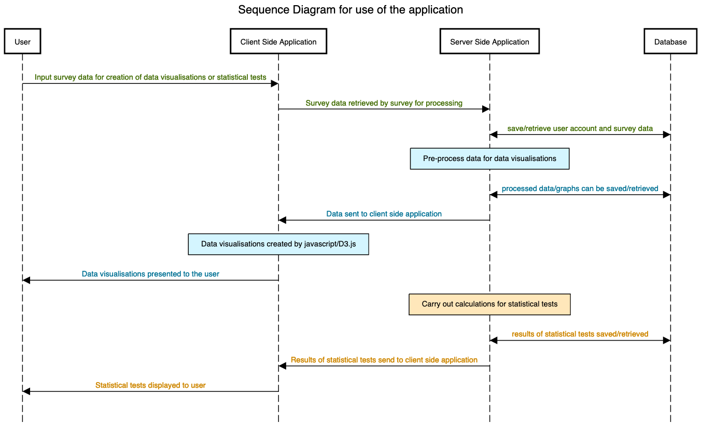
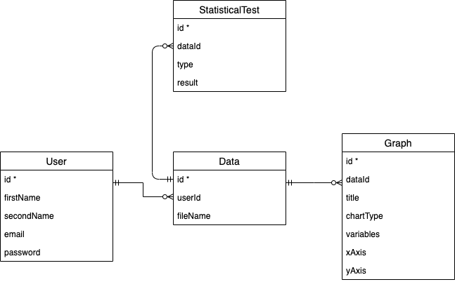
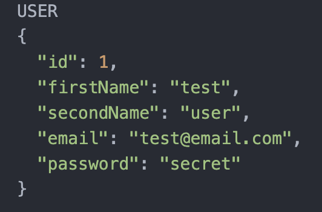
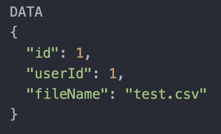
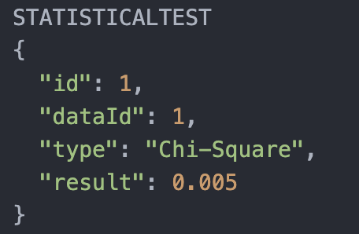

# Project Journal

This is a development journal that will be kept for the project duration and updated regularly with my progress.
It will contain information regarding what has been achieved recently and what will be looked at next.
Any specific problems I encounter or reflections that I may have will also be included.

- [Full installation list](documentation.md#installs)
- [Jump to the latest entry](#latestEntry)

<a name="latestEntry"></a>

### Pre-project setup (June 1st)

###### Goals

- Setup the preliminary folder structure, kanban board and project journal.
- Initialise a local project Git repository and remote repository on Github.
- Ensure all initial tools and programming languages required to get the project started are ready and installed, including [python3](https://www.python.org/downloads/) (and setting up a virtual environment), [Flask](https://flask.palletsprojects.com/en/1.1.x/installation/#installation), Javascript (specifically [D3.js](https://d3js.org/)) and [MongoDB](https://www.mongodb.com/). The full installation list will be kept up to date in the accompanying [code documentation](documentation.md#installs).

Following the initial installations above and after starting making a basic web application, it became apparent that I would need to handle web forms from the user (such as for file uploads).
For this I decided to download the flask extension [Flask-WTF](https://flask-wtf.readthedocs.io/en/stable/) which is a wrapper around the WTForms package.

```
pip3 install flask-wtf
```

I also installed a dropzone.js extension to allow fo easy uploading of files by dragging and dropping.

```
pip install Flask-Dropzone
```

After handling the file importing, I realised that one way to keep a record of that file is to save the file name in a database associated with that user. To do this, it would require having user accounts and subsequently a registration and login page. I therefore decided to implement these features at this point (and then at a later date I will return to handling 'guest' users, and how this information would be stored for these users without an account.)

### Preliminary System Design

The overarching goal of the project is to design a website where users can import data from their surveys, create graphical visualisations and carry out statistical tests. The application will communicate with a database, saving information regarding that user, their diagrams and statistical tests. Data imported by the user will first need to be pre-processed on the server to identify any anomalies and to prepare data for creation of graphical visualisations. The creation of the data visualisations will happen on the client side (using javascript D3.js) whilst the calculations for statistical tests will happen on the server side. The results of both will be displayed to the client and can potentially also be exported.

<p align="center">
  
</p>

In order to keep a record of the user's data, a database will be required. In the long term, there might be the option to also use the application as a guest user and this will have to be incorporated into the system. However, for the time being I will design my database around having user accounts as this will make saving data (and identifying which data belongs to which user) much easier. The preliminary design will use 4 entity tables: User (containing account information such as email and password), Data (which contains the filename of the data in table form), Graph (which will contain information regarding the title, the variables plotted (as an array) and potentially information regarding x/y-axes) and StatisticalTest (containing information on which statistical test was used, and what the result is).

<p align="center">
  
</p>

The 'Graph' entity will likely raise some problems, as it can vary between the different types of graphs. For example, a line chart will need to know what is plotted on the x-axis and what is plotted on the y-axis (and possibly z-axis), whereas a pie chart does not have an axis, but could theoretically contain any number of variables. Fortunately, using a NoSQL database allows for some degree of flexibility in this, allowing for creation of different variations of a particular entity. It also allows for the use of an array which will be useful for storing multiple variable names.
However this preliminary database schema will likely need to be reviewed and redesigned at later stages in the project when implementing.

Some examples might be as follows:

<div display="flex">
  
  
  
  
</div>
