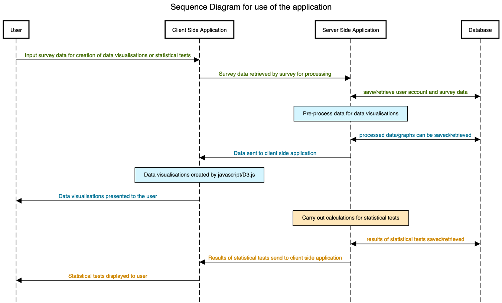
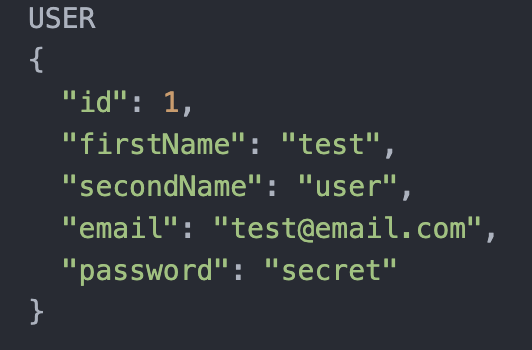
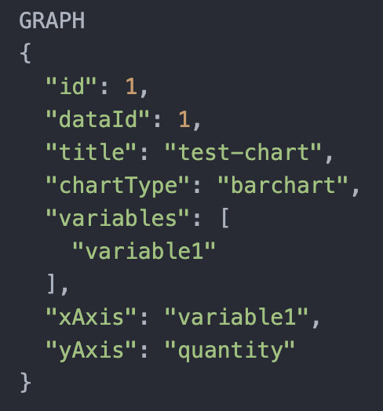

### Pre-project setup

###### Goals

- Setup the preliminary folder structure, kanban board and project journal. &#x2705;
- Initialise a local project Git repository and remote repository on Github. &#x2705;
- Ensure all initial tools and programming languages required to get the project started are ready and installed, including:
  * [python3](https://www.python.org/downloads/) (and setting up a virtual environment). &#x2705;

  * [Flask](https://flask.palletsprojects.com/en/1.1.x/installation/#installation). &#x2705;

  * Javascript (specifically [D3.js](https://d3js.org/)). &#x2705;

  * [MongoDB](https://www.mongodb.com/). &#x2705;

The full installation list will be kept up to date in the accompanying [code documentation](../documentation.md#installs).

#### Preliminary System Design
The aim is to create an initial system design that will help in the initial stages of developing the web application. The design will be continuously reviewed and assessed following the start of implementation (influenced by problems encountered, developmental requirements and user feedback) and therefore it is likely that the finished application will be quite different from the initial design.

###### Goals
- Plan general system design in preparation of first sprint, including creation of initial system diagrams. &#x2705;
- Plan and design initial database structure. &#x2705;
- Create preliminary user-interface wireframes. &#x2705;

The overarching goal of the project is to design a website where users can import data from their surveys, create graphical visualisations and carry out statistical tests. The application will communicate with a database, saving information regarding that user, their diagrams and statistical tests. Data imported by the user will first need to be pre-processed on the server to identify any anomalies and to prepare data for creation of graphical visualisations. The creation of the data visualisations will happen on the client side (using javascript D3.js) whilst the calculations for statistical tests will happen on the server side. The results of both will be displayed to the client and can potentially also be exported.

  

In order to keep a record of the user's data, a database will be required. In the long term, there might be the option to also use the application as a 'guest' user and this will have to be incorporated into the system. However, for the time being I will design my database around having user accounts as this will make saving data (and identifying which data belongs to which user) much easier. The preliminary design will use 4 entity tables: User (containing account information such as email and password), Data (which contains the filename of the data in table form), Graph (which will contain information regarding the title, the variables plotted (as an array) and potentially information regarding x/y-axes) and StatisticalTest (containing information on which statistical test was used, and what the result is).

  

The 'Graph' entity will likely raise some problems, as it can vary between the different types of graphs. For example, a line chart will need to know what is plotted on the x-axis and what is plotted on the y-axis (and possibly z-axis), whereas a pie chart does not have an axis, but could theoretically contain any number of variables. Fortunately, using a NoSQL database allows for some degree of flexibility in this, allowing for creation of different variations of a particular entity. It also allows for the use of an array which will be useful for storing multiple variable names.
However this preliminary database schema will likely need to be reviewed and redesigned at later stages in the project when implementing.

Some examples might be as follows:

  
  
  
  

##### Wireframes
The original wireframes have been constructed using [pencil project](https://pencil.evolus.vn/) and can be found in the [wireframes](../sprint1/wireframes) folder inside sprint1.
