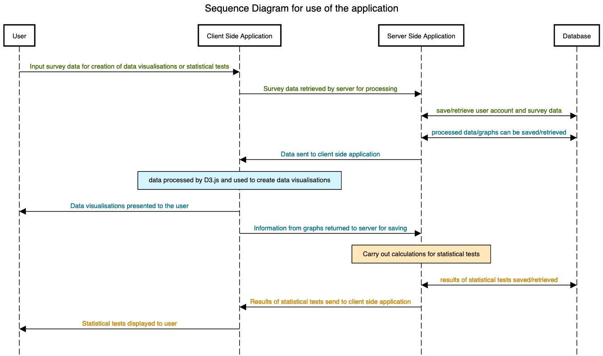
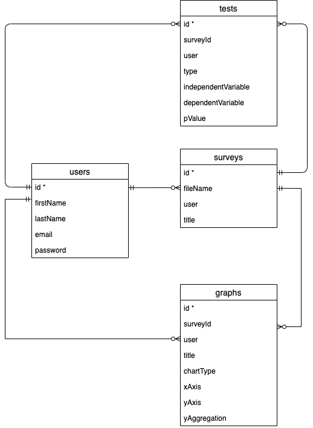

### Sprint 2 (starting 22nd June)

I have decided to move on to sprint 2 slightly earlier than anticipated (original plan in the proposal was to start sprint 2 on the 29th June). This is partly because I was able to start the project earlier than I planned but also because I have made good progress towards my objectives with the creation of a minimum viable product that would benefit from user feedback.

A summary of the user feedback can be found [here](../sprint1/journal.md#userFeedback1) at the end of sprint 1.

###### Goals
The overarching aim of sprint 2 is to review the minimum viable product with the user feedback from sprint 1 and the backlog of jobs needed to improve the application. More specifically, this will involve:

- Review system diagrams and database design and make any changes if necessary.
- Creating an export feature, allowing users to export their graph (and maybe also statistical test) as an image or pdf.
- Fixing any existing bugs, such as issue with loading javascript on the 'analyse' page. &#x2705;
- Minor changes, such as changing 'Dashboard' to 'Home', fixing case sensitivity on email login &#x2705;
- Add more choice of graphs and more statistical tests.
- Make site more responsive, so that it can be used on smaller screens such as iPad.
- Allow users to input their survey data directly, as opposed to importing a CSV/XL file.

### Review of sequence diagrams and database design (22nd June)
The 'sequence' diagram from sprint 1 is still very much valid, with only some minor changes needed. Previously I carried out the data pre-processing on the server side and sent the reduced data set needed for creating graphs to the client. However, as described in [this](../sprint1/journal.md#dynamicGraph) section, giving the user the ability to choose their variables and axes on the graph page and get instant visualisation would likely reduce traffic of the user having to go back and forth with the server to get the result they want. Therefore I have updated the sequence diagram to show how the data processing for graphs occurs mostly on the client side in D3.js.

  

The design for the database has changed also since the preliminary design. In the original design, graphs and statistical tests referenced the 'survey' entity which in turn referenced the 'user' entity. This has since changed, with graphs, tests and surveys all referencing the 'user' entity, with graphs and tests also referencing the 'survey' entity. I have updated my diagram to reflect this.

  

As discussed previously, this design is flexible, meaning that the design of the 'graph' entity will vary considerable depending on the type of graph being made (e.g. different numbers of variables, x/y axes, aggregations etc.) Furthermore, I also expect the 'test' entity to vary depending on the type of test. This is an advantage of using a document based database such as MongoDB. The python code will be able to check the 'type' of graph/statistical test and then know how to read it accordingly.

### Bug fixing (22nd June)

I explored the different possible reasons why the javascript file was not loading for one user when accessing the 'analyse' page for creating statistical tests. After some searching around on the internet, I realised that one possible reason could've been the use of an adblocker preventing some of the content being loaded. A lot of adblockers will identify any static files such as images, CSS and javascript files with 'suspicious' sounding names (names such as 'advert.jpg'). My javascript file for the analyse page was called 'analyse.js' which I thought could have been a culprit. I downloaded an adblocker extension to test it on my computer and discovered that changing the name from 'analyse.js' to 'statistic.js' solved the problem!

### Account edit (22nd June)

One comment was to allow for editing account details. I have therefore added an 'account' page where users can update their email, first name or last name. I will update this soon to allow users to also reset their password.

### Initial attempts at creating an editable table page (23rd June)

One of the comments in the user feedback was to create a way for users to manually input data, as opposed to importing it from a file. I thought that one way to do this nicely would be to create a mini excel-like table in the website where users can manually input data. This would also allow users to edit data in their uploaded files. To do this I looked at the javascript extension 'handsontable'. This allows me to render existing excel/csv files in table format.
To do this, the data has to first be converted to an object or 2d array on the server side. This can then be sent to the client javascript using flask and then rendered using client side javascript. To 'save' the changes, the javascript needs to 'post' the updated table back to the server using an AJAX post request.
So far, I have implemented editing a table. However this is still at an early stage and will need reviewing and updating as I go. Furthermore, I will need to work out how to allows users to make tables from scratch (i.e. adding rows and columns themselves, as opposed to editing rows/columns that already exist.)

To make this simpler, I may return to how the files are saved (currently they are saved as excel or csv files. However, I may change this so that all files are saved as CSV. This will make updating the files much easier as the information saved by 'handsontable' is typically in CSV format unless otherwise specified - which would be hacky to code as the client would need to know if it is Excel or CSV before sending it)

### Continued work on 'edit table' and 'new table' (24th June)

Today I have continued to try and get familiar with using handsontable as a tool for editing existing tables and for creating tables. I have now added features so that users can add more columns to the table with a column header for each, representing that variable/survey question.

I have also made it so that rows are automatically added (i.e. when the user enters in data in the final row a new row is automatically added on) and that any empty rows are not saved.

I have also began to work on the page also being able to start with an empty table, so that users can manually input data from scratch if they do not yet have an excel file or csv file.

The overall appearance of this page will still need reworking. Also presently, when the user is creating the table from scratch it does not yet save it to the database. This will be the next thing I work on before moving onto other issues highlighted from the user feedback.

### Finishing table edit page and redesigning home/dashboard (25th June)

Today I continued working on the 'edit' table page, allowing users to save their changes after editing their raw data, as well as being able to start a new survey/table from scratch and save this.
The saving of the table produced a few challenges. Predominantly it was with regards to sending the data back to the server via a POST request. All of my previous POST requests have been handled by WTForms, which carries out a pre-validation of the form on the server side, handles CSRF tokens and validates the return submission. However, as the table is completely built on the client side (using front end javascript and handsontable) it was difficult to think of a way to post this to the server whilst mainting security through the CSRF token. In the end, I used an AJAX call using JQuery. I extracted the CSRF token value from the WTForm (which also contained a 'title' field) and could factor this into the AJAX call.
On the server side, I was then able to extract the table data (sent in string form) and the 'title' data and carry out the appropriate save to the database.

I also changed the way I save files after a user uploads. Now, all files are converted to CSV (using pandas) before saving, which allows for easier handling at later stages.

I am also working on changing the home/dashboard. One user feedback comment said how it would be nicer if the home/dashboard is survey-centric (i.e. the user selects a survey and the dashboard focuses on that, with graphs and statistical tests from that specific survey.) Whilst this is now functional, the appearance is not quite right and will need modifying (e.g. buttons different sizes etc.). Furthermore, I am beginning to find that much of my original code (such as CSS classes) is now obsolete. I will need to spend a day in the near future refactoring code, deleting obsolete code and making my code DRY.

##### Ongoing objectives

* Add more graphs. I think line graph would be a good next one to look at as it will be quite different to bar charts. Pie-charts I think will be quite similar to bar-charts as it is mostly categorical data and aggregations, only the presentation is different.
* Add more statistical tests.
* Add an export feature.
* Improve CSS to allow for responsive web pages (particularly on the bar chart page).
* Allow users to input survey data directly.
* To carry out unit testing of the bar-chart, statistics page and dashboard pages.
* Password reset.
