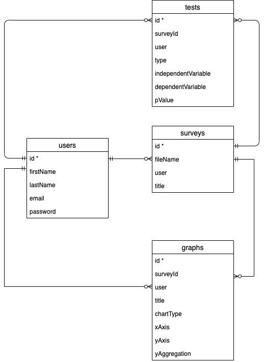

### Sprint 3 (starting 13th July)

It has been three weeks since the start of sprint 2. The total changes made over sprint 2 can be seen in my [sprint 2 journal](../sprint2/journal.md) but are summarised below:

- Two new graph types have been added to the application (a scatter chart, with an option to display as a line chart, and a pie chart).
- 3 new statistical tests have been added (Mann-Whitney U test, Chi squared test and Chi squared goodness of fit test)
- Big changes made to the user interface compared to sprint 1, integrating in Bootstrap CSS and javascript and improving the responsiveness so that it can be used on smaller screens.
- Export feature has been added - users can download their graphs as images to their devices to be used outside the app.
- Quick stats page where users can get a quick overview of their data without having to analyse it themselves.
- Manual data input - users can now input data in table form (similarly to Excel) so that they do not need to have a file that they upload. Users can also edit their uploaded files in this way.
- I have made a small demonstration video that users can find on the index/landing page.
- I have obtained a domain name (datasaur.dev) and have cloud hosted the website on Digital Ocean under a user with reduced privileges. I have also now installed Nginx on this server and use it to deliver my static files, improving responsiveness.
- I have secured my website with an SSL/TLS certificate and redirect all users from the HTTP version of the site to the HTTPS secure version.
- Improved account features: registration, login, validation/security checks, account update and password reset by email.

User feedback from sprint 2 is still being returned, but some of the key points so far include:
- Adding a histogram type chart.
- Adding more tests/graph types.
- Allowing for date/time on the scatter chart.

###### Goals
Sprint 3 will be the final sprint of the project. Therefore most of the final development will occur over the next 3 weeks. Following this sprint, I will be making only minor changes/bug fixes and refactoring the code. The overarching aim of sprint 3 is to review the existing application with the user feedback from sprint 2 and the backlog of jobs from sprint 1 and 2. I plan to refactor the code, add more features (such as graphs/statistical tests) and then to get some final user feedback on the project.

More specifically, this will involve:

- Review system diagrams and database design and make any changes if necessary.
- Adding a histogram graph type.
- Adding date/time to scatter chart/line chart.
- Adding some more commonly used statistical tests in survey data analysis.
- Reviewing existing code and refactoring any repetitive code.
- Develop a 10-question feedback form to get more detailed feedback on the final application.

### Review of sequence diagrams and database design (13th July)
Little has changed in the general system architecture of the project since the previous sprint. The sequence diagram is still very much the same, with the processing of data for graphs still being carried out by D3 on the front end, as I think that overall gives the user the best experience, despite the downside of any unused data also being sent to the client. The processing of data for statistical tests occurs on the server side, although some javascript functions are also used on the client side, to populate the pages with advice/information regarding different statistical tests.

<p align="center">
  
</p>

Likewise, the design for the database has changed very little since the previous sprint. The only additional thing I am findings is that each test and graph will have different characteristics that need saving. This is more apparent than I initially thought, with nearly every type of graph and statistical test requiring its own document structure in the database.

<p align="center">
  
</p>


### Unit testing and adding histogram. (14th July)

For a while I have wanted to carry out some more substantial testing of my pages. Using Pytest, I spent the morning testing existing pages, including import/file upload and creating statistical tests and saving them.

I am finding some difficulties with regards to testing the 'data input' page. This is because of the way that Handsontable saves the data being input into the cells which is difficult to replicate in simple post requests in pytest. Likewise, currently I am struggling to find a way to test saving graphs, as in the application an image is created of the graph SVG and converted to data URI to be transported to the server, a behaviour that is again difficult to test with pytest functions.

I have spent the afternoon making a start on the Histogram page. One difficulty I am experiencing with this is what options to give the user. A histogram is generally made up of grouped numerical data, representing a spread/distribution of that data. Therefore it should only really take one variable - the x-axis that the user would like to see the distribution of. However, a user may also want to customise the histogram in other ways, such as deciding on their own bin sizes or number of bins ('bin' here means the groups of data. For example, bins of Ages may be 0-9 years, 10-19 years, 20-29 years etc.). Not all user choices are possible, for example if the scale on the x-axis is from 0-20, then having 11 bins would not be possible. This is something I will continue to work on over the next few days. Likewise, as with the scatter chart, a user may want to choose their ranges on their x-axis which I have now enabled.

### Finished Histogram and attempts at parsing date/time. (15th July)

In the morning I managed to finish making a histogram. I tried to decide whether to add a line of best fit to the graph, so that it could give the user a good idea about the type of distribution (e.g. normal, positively skewed etc.). In the end I found that generally the histograms would display this distribution quite nicely even without adding the line, and in fact the line would quite often not represent well the apparent distribution anyway.

I spent the afternoon attempting to parse date/time. Whilst I have managed to achieve this on the server end, converting multiple different formats into Timestamp objects, it is difficult to convert this data into data that javascript can read. For example, javascript does not recognise the 'Timestamp' keyword in the data and subsequently raises an error. I will continue with this tomorrow before moving on to other matters.

### Tooltips and autostats. (16th July)

Some more user feedback came back today. It was all very positive which is nice to see! Something that came up a couple of times was to give some information regarding the statistical test and what certain things mean (e.g. significance value, null hypothesis etc.)
I have therefore added some descriptive text whenever a user selects a statistical test to run. When results are given, I have added tooltips that display the meaning of different technical terms, such as the ones mentioned above.

Something that I have planned to do for a while (and was suggested in feedback from sprint 1) was to run some 'auto' tests. This feedback was from a user who did not understand statistical tests but said they would find it helpful if the application ran some tests for them automatically.
I have started implementing some functions that will scan through the data when it is first uploaded and carry out statistical tests based on the type of data (numerical vs categorical). This obviously has some limitations and will not run all different tests on all the data (for example, non-parametric tests will only be run on definite categorical data - i.e. data that is string, object or boolean. Ordinal data with numeric values, such as likert scale, will not be tested as this data will be identified as numeric.) Furthermore, the results of tests will have to be checked by the user, to check the data passes the assumptions of the test. I plan to provide the user with the assumptions that the test makes so that they can check their data against them.

I do not perform mann whitney U and kruskal wallis on the same variables, even though it is in fact possible to perform kruskal wallis on 2 variables. This is to avoid conflicting results and subsequent increasing risk of false positives.

Any significant findings will be stored in the data base under a 'temp_results' collection. If any data is in the 'temp_results' then the user will be notified and they will have the opportunity to check it, save it (to go to their 'tests' collection) or delete it.

I am in the process of creating an HTML page that will render these features.

Depending on how long the scan takes, I may consider integrating 'threading' into my application, to handle this automatic scan in the background.

### Finished autostats. (17th July)

Today I finalised the 'auto-stats' page, rendering the different statistical tests that had significant findings. Each stat is presented with a list of assumptions that the user can check. If they want to save the stat, they can (with a custom title or an autogenerated title). This will then be saved in the 'tests' database so the user can access it from their dashboard. The user also has the option to delete/reject the finding.

### Getting user feedback and minor bug fixes. (19th - 22nd July)

I went home to see family for a long weekend. I spent some time going through the application with them, getting them to test various aspects and to get some user feedback. This was very useful, as I could watch them in person testing the application, so I could see where they would get stuck when using the app.
I found that on the whole, after uploading a file, the user would get stuck on the home page and not now how to proceed to make a graph (I have some text saying 'view graphs and tests' but this was obviously not clear to the user.) I will therefore work at changing this.

It was also insightful as many of my family wanted to test the application with massive documents, something that the server does not allow. I will therefore increase the file size to allow up to 10mb (currently at 5mb).

Some of their data sets contained anomalies, and therefore if time allows I would want to look into providing a data cleaning feature that scans their data and highlights any possible anomalies. This may have to be an extension due to limited time remaining with this project.

One final point was that uploading the large files often took some time, as my application scans them and automatically runs statistical tests on their data. This was not a problem with my test files, however with larger files it could take longer than 30 seconds. I will therefore introduce threading into my application, allowing this scan to be carried out in the background and then to alert the user when the scan is complete.

### Threading and statistical tests. (23rd July)

Today I introduced threading into the application to allow the scanning of data for auto-tests to be carried out in the background. Initially this raised a few problems. The main one being that the thread would not have the same application context of the main application. This means that all of the initialisation of the application (the configurations) as well as certain variables (current_user, current_app) could not be used. To get round this problem, it is possible to specify the app_context from within the thread. I passed the application 'object' to the threading function and then run a command:

```
with app.app_context():
    #do something
```

This then allows me to access current_user and also the database from inside the thread.

I also spent some time reviewing the statistical tests, trying to make them more specific to the data. For example, some tests require a certain sample size (chi square independence requires that 80% of the 'groups' inside the chosen variable contain more than a count of 5). Adding in these extra checks has increased my code, but has reduced the number of statistical tests carried out unnecessarily.


<a name="latestEntry"></a>
### Correcting statistical tests and starting data cleaning. (23rd July)

I realised this morning that some of the results obtained from the Chi-square goodness of fit test were incorrect. The way my function was currently setup was to calculate the percentage frequency of each group in the column and compare this with the expected percentage (i.e. if 5 Males and 15 Females, my program converted this to 25% males and 75% females). This is clearly incorrect, because even though the ratios are the same, the size of the group will also have an impact on the result (e.g. 250 Males and 750 Females is quite clearly more significant, despite the same ratio). I have therefore corrected this in my code.

I have also added a 'delete all' button on the notifications page. This is because, when surveys are very large (with 50+ columns) then there is potential for there to be a very large amount of significant findings. It is very manual for the user to have to delete these one at a time and therefore adding a delete all button will hopefully make this easier.

I have began working on some basic data cleaning. I have added functions that will remove empty rows or empty columns from the beginning of a dataset (some users do not start their tables on the first column/row on an excel spreadsheet and therefore the program should account for that). I have also added in a function that will automatically trim leading and trailing white spaces in any "string" data. I considered also automatically converting the cells to upper or lower case, however this may be something that the user wants to keep separate (for example, they may want to use 'a' and 'A' as different results and therefore would not want automatic conversion). I may decide to add a button that will convert the case for the user if they wish. These entries (as with the leading and trailing white spaces mentioned previously) are read as separate values and therefore can create some confusion for the user when they attempt to make graphs and see that multiple variables are displayed instead of just one.

Lastly, adding some sort of spell checker may be useful for the user, although again I think this should be a manual function instead of being carried out automatically (as a user may wish to have 2 variables, both with similar names, but to be treated differently.) I will continue to work on this over the weekend.

##### Ongoing objectives

* Relook at home page to make it more intuitive.
* Increase file size allowance.
* Finish looking at statistical tests assumptions.
* To carry out unit testing graph saving and manual data input pages.
* Refactoring code.
